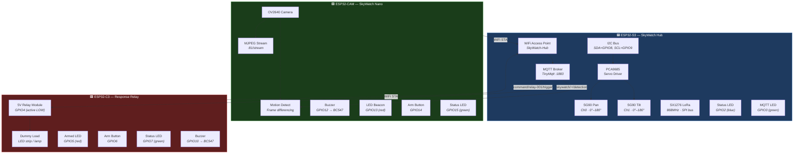
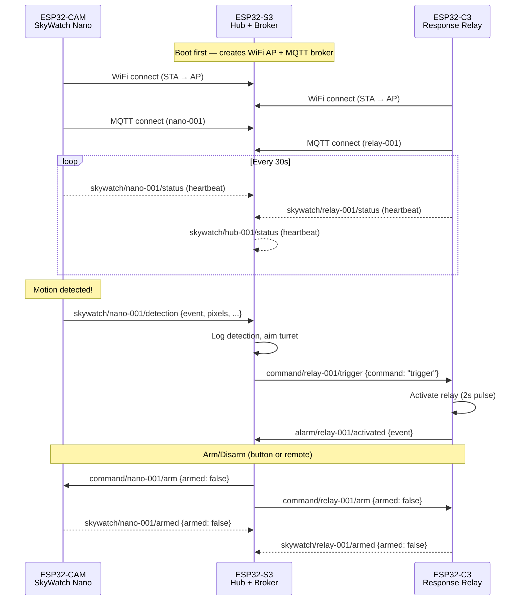
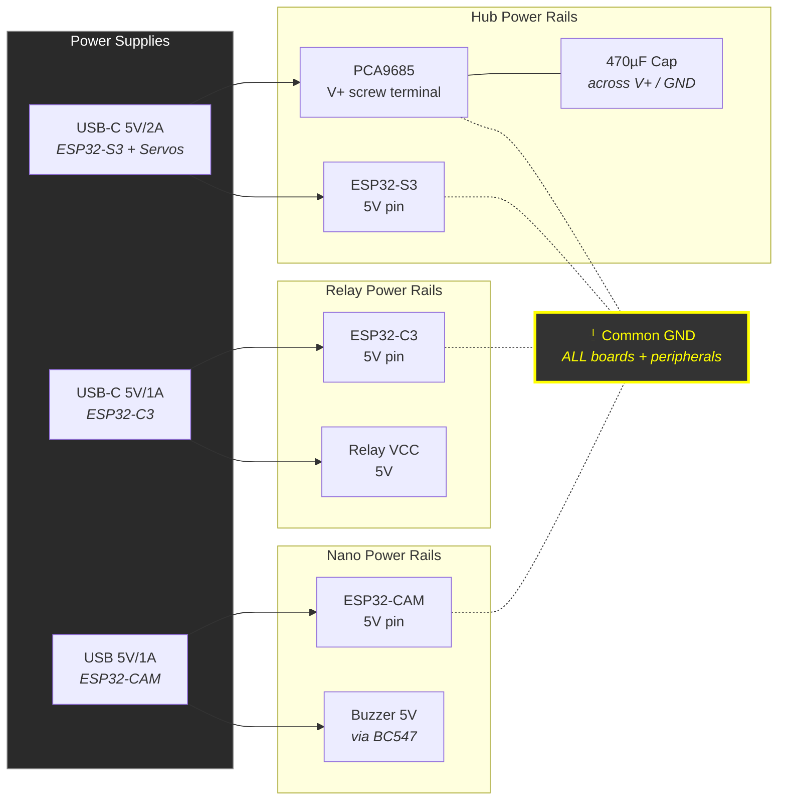
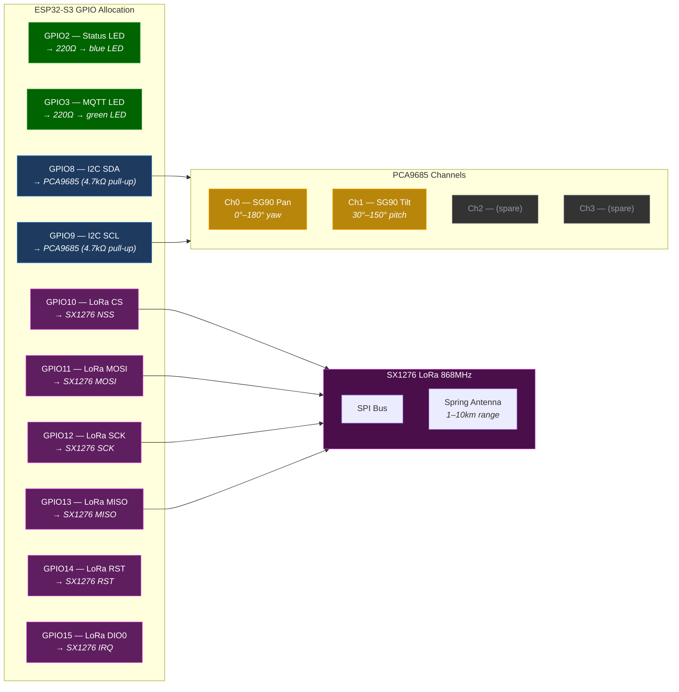
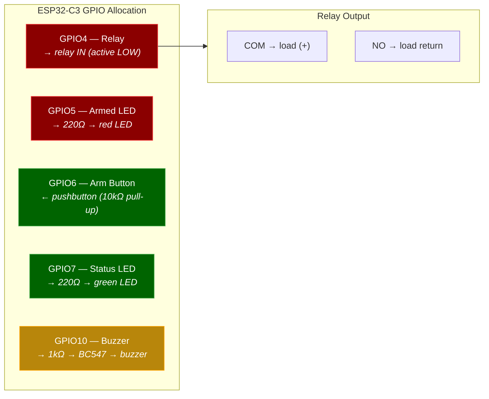

# Phase 1 Wiring Diagrams

Complete wiring reference for the three-node ESP32 Phase 1 demo stack. All
connections assume **no SD card** on the ESP32-CAM (frees GPIO12–15 for
peripherals) and a **separate 5V supply** for servos.

---

## System Topology



## Data Flow (MQTT Messages)



## Power Distribution



## GPIO Pin Maps

### ESP32-CAM (SkyWatch Nano)

```mermaid
graph LR
    subgraph ESP32_CAM["ESP32-CAM GPIO Allocation"]
        direction TB
        G0["GPIO0 — Boot mode<br/><i>GND=flash, float=run</i>"]
        G1["GPIO1 — UART TX<br/><i>→ FTDI RX (programming)</i>"]
        G3["GPIO3 — UART RX<br/><i>→ FTDI TX (programming)</i>"]
        G4["GPIO4 — Flash LED<br/><i>Built-in (reserved)</i>"]
        G12["GPIO12 — Buzzer<br/><i>→ 1kΩ → BC547 → buzzer</i>"]
        G13["GPIO13 — LED Beacon<br/><i>→ 220Ω → red LED</i>"]
        G14["GPIO14 — Arm Button<br/><i>← pushbutton (10kΩ pull-up)</i>"]
        G15["GPIO15 — Status LED<br/><i>→ 220Ω → green LED</i>"]
    end

    style G0 fill:#555,stroke:#aaa,color:#fff
    style G1 fill:#555,stroke:#aaa,color:#fff
    style G3 fill:#555,stroke:#aaa,color:#fff
    style G4 fill:#8b0000,stroke:#f44,color:#fff
    style G12 fill:#b8860b,stroke:#ffa500,color:#fff
    style G13 fill:#b8860b,stroke:#ffa500,color:#fff
    style G14 fill:#006400,stroke:#4caf50,color:#fff
    style G15 fill:#006400,stroke:#4caf50,color:#fff
```



### ESP32-S3 (Hub + Turret + LoRa Gateway)



### ESP32-C3 (Response Relay)



## System Overview (Text Reference)

```text
┌────────────────────┐       WiFi (MQTT)       ┌─────────────────────┐
│   ESP32-CAM        │◄────────────────────────►│   ESP32-S3          │
│   SkyWatch Nano    │  skywatch/nano/detection  │   Hub + Turret      │
│   (camera node)    │  skywatch/nano/status      │   (WiFi AP + MQTT   │
│                    │                            │    broker + I2C     │
│   Peripherals:     │                            │    servo control)   │
│   - Buzzer (GPIO12)│                            │                     │
│   - LED    (GPIO13)│                            │   Peripherals:      │
│   - Button (GPIO14)│                            │   - PCA9685 (I2C)   │
│   - Status (GPIO15)│                            │   - SG90 pan  (Ch0) │
└────────────────────┘                            │   - SG90 tilt (Ch1) │
                                                  │   - Status LED      │
                                                  └──────────┬──────────┘
                                                             │ MQTT
                                                  ┌──────────┴──────────┐
                                                  │   ESP32-C3          │
                                                  │   Response Relay    │
                                                  │   (alarm node)      │
                                                  │                     │
                                                  │   Peripherals:      │
                                                  │   - Relay/MOSFET    │
                                                  │   - LED (dummy load)│
                                                  │   - Arm switch      │
                                                  │   - Status LED      │
                                                  └─────────────────────┘
```

---

## Node 1: ESP32-CAM — SkyWatch Nano (Detection)

Camera-equipped detection node. Captures frames, streams over WiFi, publishes
detection events to MQTT.

### Pinout Reference (ESP-32S / ESP32-CAM)

```text
Left side:                    Right side:
  GPIO4  (HS2_DATA1)           GND
  GPIO2  (HS2_DATA0)           GPIO1  (U0TXD)
  GPIO14 (HS2_CLK)             GPIO3  (U0RXD)
  GPIO15 (HS2_CMD)             3.3V/5V
  GPIO13 (HS2_DATA3)           GND
  GPIO12 (HS2_DATA2)           GPIO0  (CSI_MCLK)
  GND                          GPIO16 (U2RXD)
  5V                           3.3V
```

### Peripheral Wiring

```text
ESP32-CAM Pin    Connection              Component         Notes
─────────────    ──────────              ─────────         ─────
GPIO12         → 1kΩ → BC547 base       Active buzzer     NPN transistor driver
                       collector → buzz(-)                  buzz(+) → 5V
                       emitter → GND

GPIO13         → 220Ω → LED anode       LED beacon        High-bright red/amber
                         cathode → GND                     Visual alarm indicator

GPIO14         → pushbutton → GND       Arm/disarm        10kΩ pull-up to 3.3V
                                                           Press = LOW = toggle

GPIO15         → 220Ω → LED anode       Status LED        Green = connected
                         cathode → GND                     Blink = detecting

GPIO4          — (reserved)             Built-in flash    Do not reassign
GPIO0          — float (run) / GND      Boot mode         GND only during flash
GPIO1 (TX)     → FTDI RX               Programming       Disconnect after flash
GPIO3 (RX)     → FTDI TX               Programming       Disconnect after flash

5V             ← 5V supply              Power in          USB or buck converter
GND            ← common GND            Ground             Shared with all nodes
```

### Buzzer Circuit Detail

```text
                    5V
                     │
                  Buzzer (+)
                     │
                  Buzzer (-)
                     │
               ┌─── Collector
               │
  GPIO12 ─── 1kΩ ─── Base     (BC547 NPN)
               │
               └─── Emitter
                     │
                    GND
```

### Programming Setup (FTDI USB-TTL)

```text
ESP32-CAM        FTDI Adapter
─────────        ────────────
5V          ───→ VCC (jumper set to 5V)
GND         ───→ GND
GPIO1 (TX)  ───→ RX
GPIO3 (RX)  ───→ TX
GPIO0       ───→ GND (during upload only, then disconnect)

Flash procedure:
  1. Connect GPIO0 to GND
  2. Press RST button on ESP32-CAM
  3. Upload firmware via Arduino IDE / PlatformIO
  4. Disconnect GPIO0 from GND
  5. Press RST to run firmware
```

---

## Node 2: ESP32-S3 — Hub + Turret Controller

Central coordinator. Runs WiFi access point, lightweight MQTT broker, and
controls pan/tilt servos via PCA9685 I2C servo driver.

### PCA9685 → ESP32-S3 Wiring

```text
PCA9685 Pin      ESP32-S3 Pin     Notes
───────────      ────────────     ─────
VCC (logic)    → 3.3V             Logic supply (NOT servo power)
GND            → GND              Common ground
SDA            → GPIO8            I2C data
SCL            → GPIO9            I2C clock
OE             — (float or GND)   Output enable (LOW = enabled)

V+ (screw terminal) → 5V servo supply   Separate PSU, 5V/2A minimum
GND (screw terminal) → Common GND        MUST tie to ESP32 GND
```

### Servo Connections (PCA9685 headers)

```text
PCA9685 Channel   Servo       Role         Angle Range
───────────────   ─────       ────         ───────────
Channel 0         SG90 #1     Pan (yaw)    0°–180°
Channel 1         SG90 #2     Tilt (pitch) 0°–180°
Channel 2         (spare)     Future use   —
Channel 3         (spare)     Future use   —

Each servo connector (3-pin):
  Orange wire → PWM signal (from PCA9685)
  Red wire    → V+ (from PCA9685 V+ rail, NOT ESP32)
  Brown wire  → GND (from PCA9685 GND rail)
```

### Power Architecture

```text
                    ┌──────────────────────────────┐
                    │     5V / 2A Power Supply      │
                    │     (phone charger or buck)    │
                    └──────────┬───────────────────┘
                               │
                    ┌──────────┴───────────────────┐
                    │                               │
              ┌─────┴─────┐                 ┌──────┴──────┐
              │ PCA9685   │                 │  ESP32-S3   │
              │ V+ screw  │                 │  5V pin     │
              │ terminal  │                 │  (or USB)   │
              └─────┬─────┘                 └──────┬──────┘
                    │                               │
                    └──────────┬────────────────────┘
                               │
                              GND (common)

    IMPORTANT: Servo V+ rail and ESP32 must share common GND.
    Add 470–1000µF electrolytic capacitor across V+ and GND
    on the PCA9685 screw terminals to absorb servo current spikes.
```

### SX1276 LoRa Module → ESP32-S3 Wiring (SPI)

Long-range radio for bridging alerts beyond WiFi range (1–10km). Uses the bare
SX1276 module (1.27mm castellated pads — solder to breakout or direct wire).

```text
SX1276 Pin       ESP32-S3 Pin     Notes
──────────       ────────────     ─────
VCC            → 3.3V             3.3V ONLY — 5V will destroy the module!
GND            → GND              Common ground
SCK            → GPIO12           SPI clock
MISO           → GPIO13           SPI data out (from SX1276)
MOSI           → GPIO11           SPI data in (to SX1276)
NSS (CS)       → GPIO10           Chip select
RST            → GPIO14           Reset
DIO0           → GPIO15           Interrupt (RX done / TX done)
DIO1           — (not connected)  Optional — CAD detection
DIO2           — (not connected)  Optional — frequency hop
ANT            → spring antenna   Solder spring antenna to ANT pad
```

**LoRa Radio Configuration (firmware defaults):**

| Parameter | Value | Notes |
| --------- | ----- | ----- |
| Frequency | 868 MHz | SA/EU ISM band (change to 915 for US/AU) |
| Spreading Factor | SF9 | ~5km range, ~1.7kbps |
| Bandwidth | 125 kHz | Standard LoRa |
| TX Power | 17 dBm | Max 20 for SX1276 |
| Coding Rate | 4/5 | Error correction |
| Sync Word | 0x34 | Private network |

### ESP32-S3 Additional Peripherals

```text
ESP32-S3 Pin     Connection              Component         Notes
────────────     ──────────              ─────────         ─────
GPIO8          → PCA9685 SDA            I2C data          4.7kΩ pull-up to 3.3V
GPIO9          → PCA9685 SCL            I2C clock         4.7kΩ pull-up to 3.3V
GPIO10         → SX1276 NSS            LoRa chip select  SPI
GPIO11         → SX1276 MOSI           LoRa data in      SPI
GPIO12         → SX1276 SCK            LoRa clock        SPI
GPIO13         → SX1276 MISO           LoRa data out     SPI
GPIO14         → SX1276 RST            LoRa reset
GPIO15         → SX1276 DIO0           LoRa interrupt    RX/TX done
GPIO2          → 220Ω → LED anode      Status LED        Blue = hub active
                         cathode → GND
GPIO3          → 220Ω → LED anode      MQTT LED          Blink on message rx
                         cathode → GND
```

---

## Node 3: ESP32-C3 — Response Relay

Receives arm/disarm and trigger commands via MQTT. Drives safe demo outputs
(LED, lamp, buzzer) via relay or MOSFET. No launcher hardware.

### ESP32-C3 Wiring

```text
ESP32-C3 Pin     Connection              Component          Notes
────────────     ──────────              ─────────          ─────
GPIO4          → relay module IN         5V relay module    Active LOW trigger
                 relay VCC → 5V                             Or use MOSFET board
                 relay GND → GND
                 relay NO/COM → LED/lamp  Dummy load        Safe output only

GPIO5          → 220Ω → LED anode       Armed status LED   Red = armed
                         cathode → GND                      Off = disarmed

GPIO6          → pushbutton → GND       Arm/disarm switch  10kΩ pull-up to 3.3V
                                                            Physical safety

GPIO7          → 220Ω → LED anode       Status LED         Green = connected
                         cathode → GND                      Blink = MQTT active

GPIO10         → 1kΩ → BC547 base       Buzzer (optional)  Same circuit as CAM
                        collector → buzz(-)
                        emitter → GND

5V             ← 5V supply              Power in           USB-C or buck
GND            ← common GND            Ground              Shared ground
```

### Relay Circuit Detail

```text
                    5V supply
                     │
              ┌──────┴──────┐
              │  Relay VCC  │
              │             │
              │  Relay      │───→ COM ──→ LED strip / lamp (+)
  GPIO4 ────→│  IN         │───→ NO  ──→ (return through load to GND)
              │             │
              │  Relay GND  │
              └──────┬──────┘
                     │
                    GND (common)

    Alternative: MOSFET board (IRF520 or similar)
    for PWM dimming capability on the dummy load.
```

---

## Bill of Materials (Phase 1 Complete)

### Boards (already owned)

| Item | Qty | Role | Est. Cost |
| ---- | --- | ---- | --------- |
| ESP32-S3 dev board | 1 | Hub + turret brain | (owned) |
| ESP32-C3 dev board | 1 | Response relay | (owned) |
| ESP32-CAM (OV2640) | 1 | Camera detection node | **R150–250** |

### Turret Kit

| Item | Qty | Role | Est. Cost |
| ---- | --- | ---- | --------- |
| PCA9685 16-ch servo driver | 1 | I2C PWM controller | **R60–100** |
| SG90 micro servo | 2 (+2 spare) | Pan + tilt | **R60–120** |
| Pan/tilt bracket (FPV nylon) | 1 | Gimbal mount | **R30–80** |

### LoRa Radio

| Item | Qty | Role | Est. Cost |
| ---- | --- | ---- | --------- |
| SX1276/SX1278 LoRa module (868MHz) | 2 | Long-range radio (hub + remote) | **R56–112** |
| Spring antenna (868MHz) | 2 | Included with module | (included) |

### Common Components

| Item | Qty | Role | Est. Cost |
| ---- | --- | ---- | --------- |
| BC547 NPN transistor | 3 | Buzzer/relay drivers | R5 |
| 1kΩ resistor | 5 | Base resistors | R2 |
| 220Ω resistor | 6 | LED current limiting | R2 |
| 10kΩ resistor | 3 | Pull-ups for buttons | R2 |
| 5mm LEDs (red, green, blue) | 6 | Status indicators | R5 |
| Active buzzer (5V) | 2 | Audio alarm | R10 |
| Pushbutton (momentary) | 2 | Arm/disarm switches | R5 |
| 5V relay module | 1 | Response relay output | R15–30 |
| 470µF electrolytic cap | 1 | Servo rail decoupling | R3 |
| FTDI USB-TTL adapter | 1 | ESP32-CAM programming | R30–60 |
| Jumper wires (M-F, M-M) | 40 | Connections | R15–30 |
| Breadboard (half-size) | 2 | Prototyping | R20–40 |
| 5V/2A USB charger | 1 | Servo power supply | R30–50 |

### Estimated Total (new purchases only)

| Category | Cost (ZAR) |
| -------- | ---------- |
| ESP32-CAM | R150–250 |
| Turret kit (PCA9685 + servos + bracket) | R150–300 |
| LoRa modules (2x SX1276) | R56–112 |
| Common components | R140–240 |
| **Total** | **R496–902** |

---

## Safety Notes

1. **Common ground is mandatory.** All power supplies, ESP32 boards, PCA9685,
   relay modules, and peripherals must share a single ground reference.
2. **Set buck converter voltage before connecting.** Adjust MP1584EN or similar
   to 5.0–5.1V with no load, then connect.
3. **Bulk capacitor on servo rail.** 470–1000µF across PCA9685 V+ and GND to
   absorb current spikes when servos move.
4. **Never power servos from ESP32.** 4 SG90s draw ~2A under load; the ESP32's
   3.3V regulator cannot supply this.
5. **GPIO0 on ESP32-CAM.** Must be LOW (GND) for flash mode, floating for run
   mode. Do not connect permanently to GND.
6. **No launcher or harmful hardware.** Phase 1 response relay drives LEDs,
   lamps, or buzzers only. See
   [safety boundary](../../docs-staging/engineering/phase1/safety-boundary.mdx).

---

## MQTT Topic Map

All three nodes communicate via these topics:

```text
skywatch/{node_id}/detection    → CAM publishes detection events (QoS 0)
skywatch/{node_id}/status       → All nodes publish heartbeat (QoS 0)
skywatch/{node_id}/armed        → Nodes publish arm/disarm state (QoS 1)
command/{node_id}/aim           → Hub → turret: pan/tilt angles (QoS 1)
command/{node_id}/trigger       → Hub → relay: activate output (QoS 1)
command/{node_id}/arm           → Hub → any: arm/disarm command (QoS 1)
command/{node_id}/config        → Hub → any: config update (QoS 1)
alarm/{node_id}/activated       → Relay publishes when triggered (QoS 1)
```

---

## Next Steps

1. Flash firmware to each ESP32 (see `apps/firmware/` for source)
2. Power up ESP32-S3 first (creates WiFi AP + MQTT broker)
3. Connect ESP32-CAM — verify camera stream and MQTT detection events
4. Connect ESP32-C3 — verify relay triggers on MQTT command
5. Mount servos on pan/tilt bracket, verify aim commands move turret
